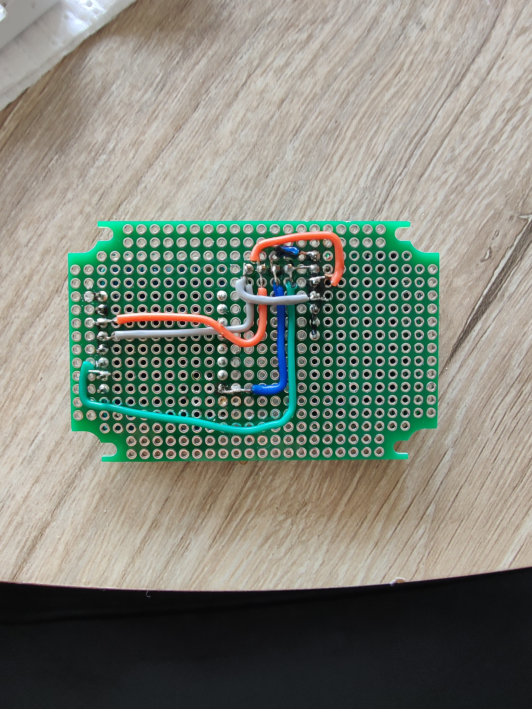
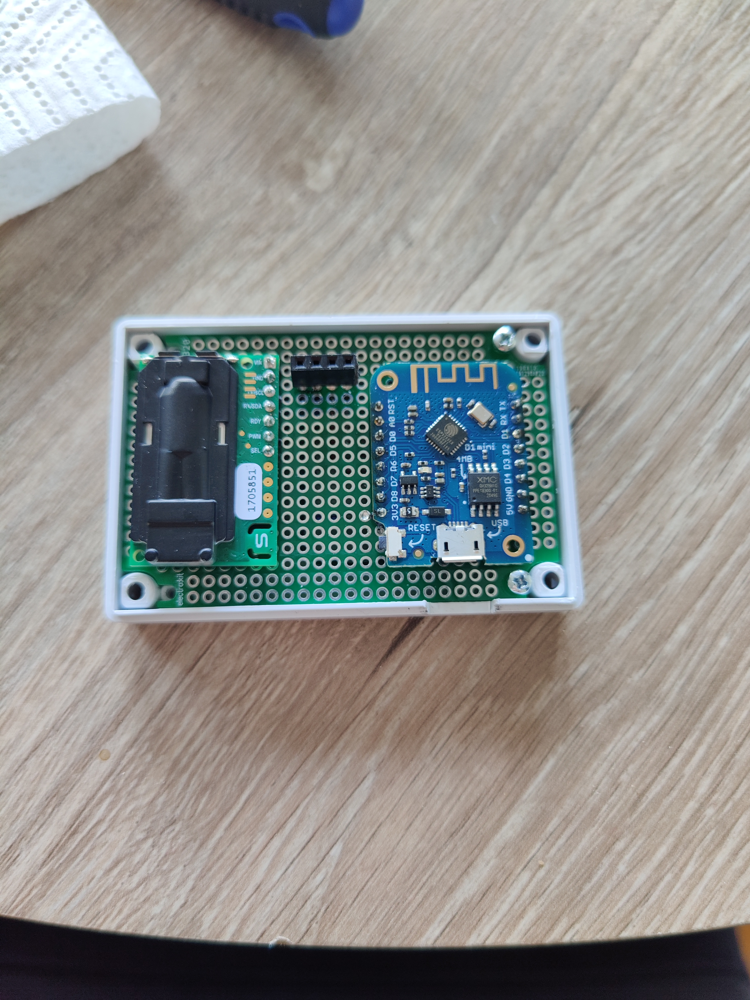
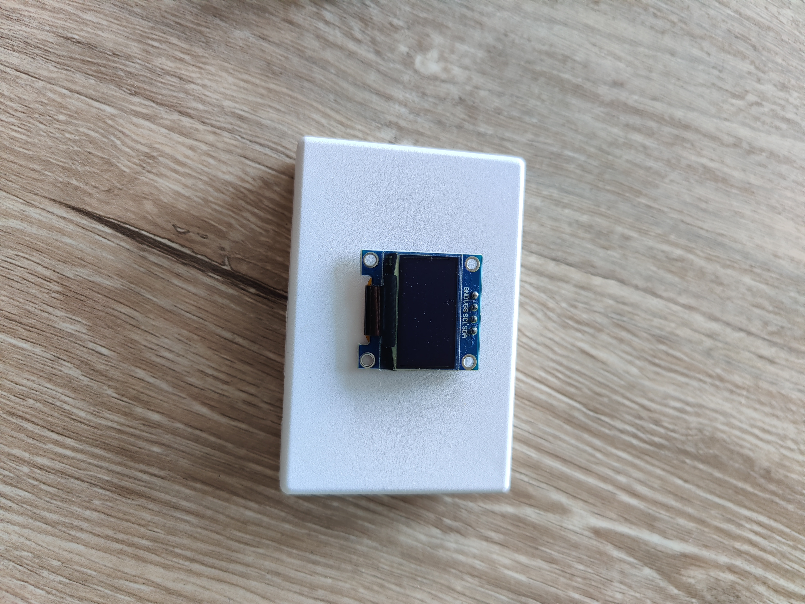

# # CO2 sensor

Files and how-to for making a CO2 sensor using the Sensirion SCD30 and a ESP 8266 (D1 Mini type)

## Introduction

This document describes how I built a CO2 sensor that integrates into [ESPHome](https://esphome.io/){:target="_blank} in [Home Assistant](https://www.home-assistant.io/){:target="_blank"}. The build is using a ESP 8266 board, the Wemos D1 mini. If you have Victoria Metrics and Grafana or equivalent in you Home Assistant you can also gain long term insights from this sensor.


Above is an example of a 7 day series, shown in Grafana with officially bad, ok and good levels. The current location of the sensor is perhaps not ideal, but the measurements have a consistent periodicity. 

## Materials

- Wemos D1 mini (or equivalent)  
- Sensirion SCD 30  
- Experiment board  
- Fitting case for experiment board  
- Display (I used the 0.96 inch SSD1306 display)  
- Cables and pins  

## Steps

1. Buy the material.

2. Integrate the main board (D1 mini) into ESPHome

3. Solder the pins to the boards.

4. Solder the boards to the exerpiment card.

5. Cut the wires in the right length and prepare to be soldered.

6. Solder the wires.

7. Flash the board through ESPHome with the code.

8. Voila! Your own CO2 sensor.

## Wiring

The wiring is pretty straight forward, I made a diagram to clarify it. 


For the individual pin-out diagram for SCD 30 see Sensirions webpage, or find it here:  [Sensirion SCD 30 pinout diagram](resources/scd30_pinout.pdf){:target="_blank"}. 

### 

## Code

To get the device up and running you need to first make the initial flash of the ESP8266 board. Just plug the USB into the device running ESPHome/Home Assistant and flash it. After this you edit the ESPHome code and flash it remotely.

The code is pretty long, but the main parts are the 

- ESPHome/Home Assistant support libraries/settings (think: wifi, time,api-key, fallback mode)

- after this comes setting up the sensors (like: which pin it is connected to and what address). 
  
  # 
  
  The i2c protocol uses only one wire, thus the address needs to be specified. Note those places in the code `address: 0x61` and `address: 0x3C` for `sensor:` and `display:`.
  
  Here is the code:
  
  

```yml
esphome:
 name: esp-co2
 friendly_name: esp-co2

esp8266:
 board: d1_mini

# Enable logging
logger:

# Enable Home Assistant API
api:
 encryption:
   key: "YOUR KEY"

ota:
 password: "YOUR PASSWORD"

wifi:
 ssid: !secret wifi_ssid
 password: !secret wifi_password

 # Enable fallback hotspot (captive portal) in case wifi connection fails
 ap:
   ssid: "Esp-Co2 Fallback Hotspot"
   password: "SOME PASSWORD"

captive_portal:

time:
 - platform: homeassistant
   id: esptime


i2c:
  - id: bus_scd30
    sda: 4
    scl: 5
    scan: true

binary_sensor:
 - platform: status
   name: "CO2 - sensor1 Status"

switch:
 - platform: restart
   name: "CO2 - sensor1 Restart"

sensor:
 - platform: scd30
   co2:
     id: "espco2_co2"
     name: "espco2:CO2"
     accuracy_decimals: 1
   temperature:
     id: "espco2_temp"
     name: "espco2:Temp"
     accuracy_decimals: 1
   humidity:
     id: "espco2_humidity"
     name: "espco2:Humidity"
     accuracy_decimals: 1
   #temperature_offset: 1.5 °C
   i2c_id: bus_scd30
   address: 0x61
   update_interval: 5s

font:
 - file: 'slkscr.ttf'
   id: font1
   size: 12

 - file: 'BebasNeue-Regular.ttf'
   id: font2
   size: 20

 - file: 'arial.ttf'
   id: font3
   size: 12


display:
 - platform: ssd1306_i2c
   model: "SSD1306 128x64"
   reset_pin: D0
   address: 0x3C
   lambda: |-

     // Print time in HH:MM format
     it.strftime(32, 0, id(font2), TextAlign::TOP_CENTER, "%H:%M", id(esptime).now());

     // Print inside temperature (from homeassistant sensor)
     if (id(espco2_temp).has_state()) {
       it.printf(50, 30, id(font3), TextAlign::BASELINE_RIGHT , "%.1f°", id(espco2_temp).state);
     }

     // Print inside temperature (from homeassistant sensor)
     if (id(espco2_humidity).has_state()) {
       it.printf(55, 30, id(font3), TextAlign::BASELINE_LEFT , "%.1f pct", id(espco2_humidity).state);
     }
     // Print inside temperature (from homeassistant sensor)
     if (id(espco2_co2).has_state()) {
       it.printf(30, 45, id(font3), TextAlign::BASELINE_LEFT , "%.1f ppm", id(espco2_co2).state);
     }
```

### Log errors

You might see log entry with ```Component display took a long time for an operation``` and ```Component should block for at most 20-30ms```. This is not strange, and the log message can be suppressed by adding this to the code

```yml
logger:
  level: DEBUG
  logs:
    component: ERROR
```

### Display

The last section of the code, with the "lambda" function is where things are printed to display. Do mess around with the C-code contained in this function to change how things are showed.

## Results

The device has been running now for over a year, and everything works as expected. Of course the measurements are mainly useful in relative terms, i.e. have the CO2 level gone up or down? Not, "the CO2 level is now exactly XXX ppm".




