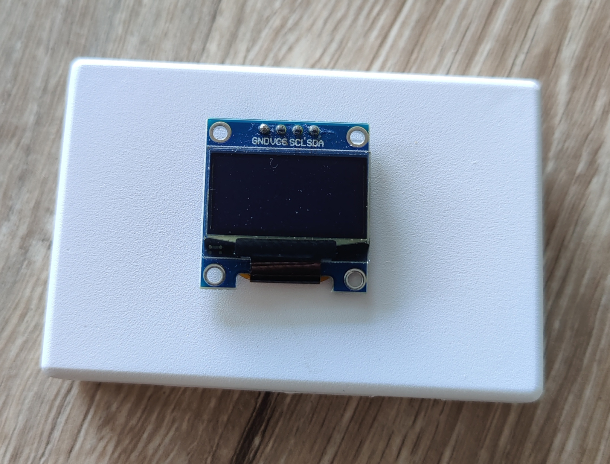

# CO2 sensor

Files and how-to for making a CO2 sensor using the Sensirion SCD30 and a ESP 8266 (D1 Mini type)

[extras.md](extras.md)

## Introduction

## Materials

## Wiring

[Sensirion SCD 30 pinout diagram](resources/scd30_pinout.pdf){:target="_blank"}


## Code


```yml
esphome:
  name: esp-co2
  friendly_name: esp-co2

esp8266:
  board: d1_mini

# Enable logging
logger:

# Enable Home Assistant API
api:
  encryption:
    key: "YOUR KEY"

ota:
  password: "YOUR PASSWORD"

wifi:
  ssid: !secret wifi_ssid
  password: !secret wifi_password

  # Enable fallback hotspot (captive portal) in case wifi connection fails
  ap:
    ssid: "Esp-Co2 Fallback Hotspot"
    password: "SOME PASSWORD"

captive_portal:
    
time:
  - platform: homeassistant
    id: esptime


i2c:
   - id: bus_scd30
     sda: 4
     scl: 5
     scan: true

binary_sensor:
  - platform: status
    name: "CO2 - sensor1 Status"

switch:
  - platform: restart
    name: "CO2 - sensor1 Restart"

sensor:
  - platform: scd30
    co2:
      id: "espco2_co2"
      name: "espco2:CO2"
      accuracy_decimals: 1
    temperature:
      id: "espco2_temp"
      name: "espco2:Temp"
      accuracy_decimals: 1
    humidity:
      id: "espco2_humidity"
      name: "espco2:Humidity"
      accuracy_decimals: 1
    #temperature_offset: 1.5 °C
    i2c_id: bus_scd30
    address: 0x61
    update_interval: 5s


font:
  - file: 'slkscr.ttf'
    id: font1
    size: 12

  - file: 'BebasNeue-Regular.ttf'
    id: font2
    size: 20

  - file: 'arial.ttf'
    id: font3
    size: 12


display:
  - platform: ssd1306_i2c
    model: "SSD1306 128x64"
    reset_pin: D0
    address: 0x3C
    lambda: |-

      // Print time in HH:MM format
      it.strftime(32, 0, id(font2), TextAlign::TOP_CENTER, "%H:%M", id(esptime).now());

      // Print inside temperature (from homeassistant sensor)
      if (id(espco2_temp).has_state()) {
        it.printf(50, 30, id(font3), TextAlign::BASELINE_RIGHT , "%.1f°", id(espco2_temp).state);
      }
      
      // Print inside temperature (from homeassistant sensor)
      if (id(espco2_humidity).has_state()) {
        it.printf(55, 30, id(font3), TextAlign::BASELINE_LEFT , "%.1f pct", id(espco2_humidity).state);
      }
      // Print inside temperature (from homeassistant sensor)
      if (id(espco2_co2).has_state()) {
        it.printf(30, 45, id(font3), TextAlign::BASELINE_LEFT , "%.1f ppm", id(espco2_co2).state);
      }

```


## Results



