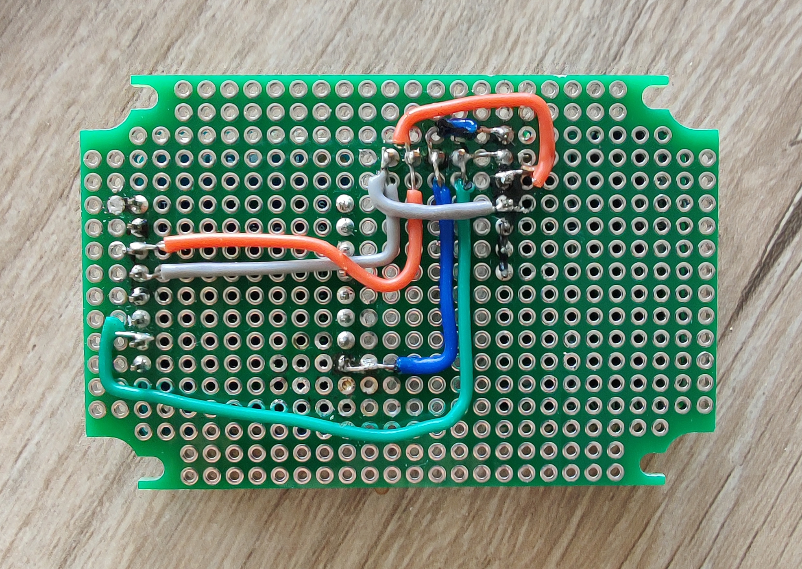

# CO2 sensor

Files and how-to for making a CO2 sensor using the Sensirion SCD30 and a ESP 8266 (D1 Mini type)

[extras.md](extras.md)

## Introduction

## Materials

## Wiring

[Sensirion SCD 30 pinout diagram](resources/scd30_pinout.pdf){:target="_blank"}

## Code

## Results

